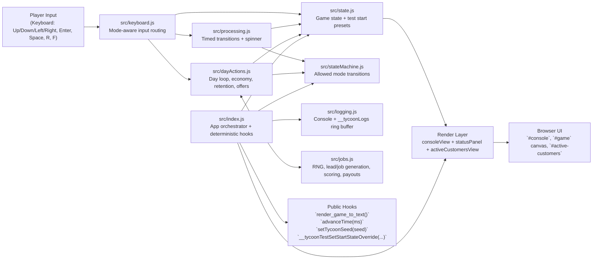
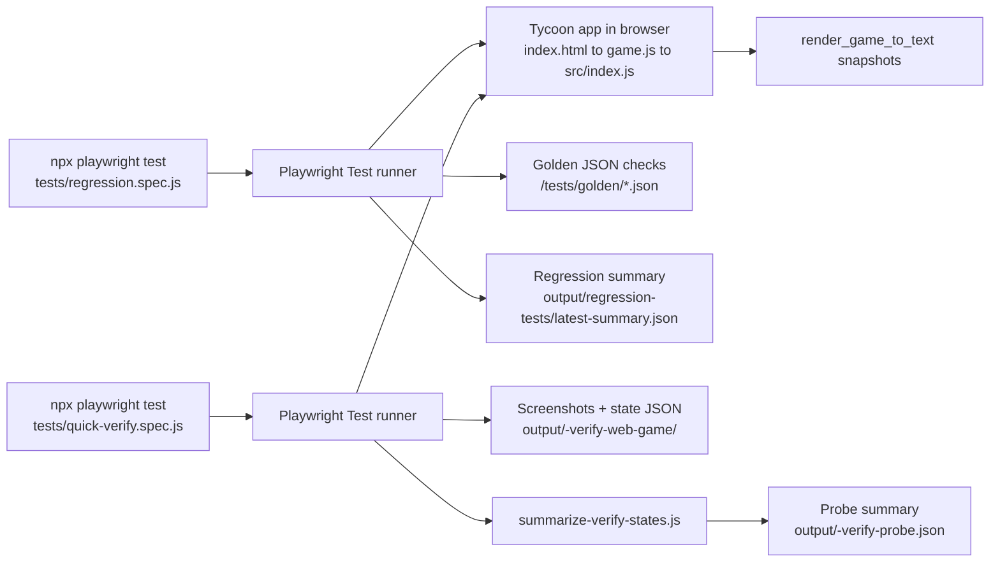

# Tycoon POC System Design

## Runtime Architecture

## Verification Pipeline

## Notes

- `src/index.js` is the composition root: initializes seeded state, attaches keyboard handlers, and drives rendering.
- Mode safety is centralized in `src/stateMachine.js`, while transition timing is mediated by `src/processing.js`.
- Economic outcomes and customer lifecycle behavior are concentrated in `src/dayActions.js` + `src/jobs.js`.
- Regression, quick-verify, and long-playthrough suites all run under Playwright Test (`tests/regression.spec.js`, `tests/quick-verify.spec.js`, `tests/long-playthrough.spec.js`).
- Regression, quick-verify, and long-playthrough flows are fixture-driven (`tests/fixtures/*.json`) and include per-scenario `start_state` metadata.
- Shared harness utilities under `tests/harness/*` centralize core runtime mechanics; scenario-specific gameplay ops and assertions remain in each suite file.
